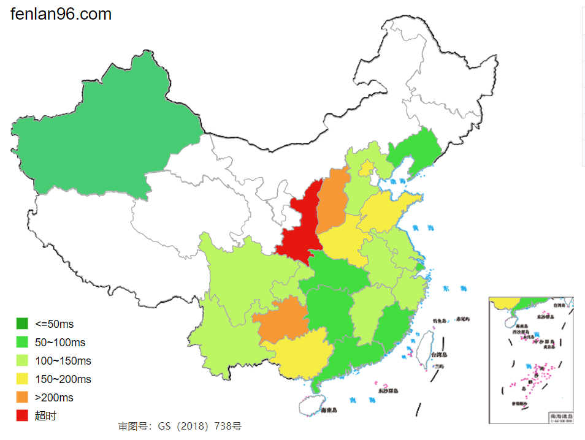
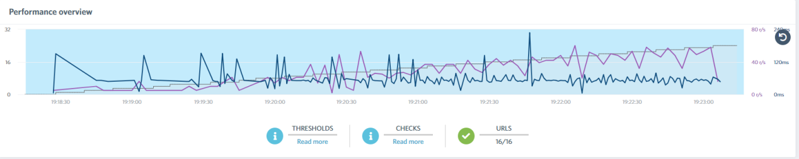
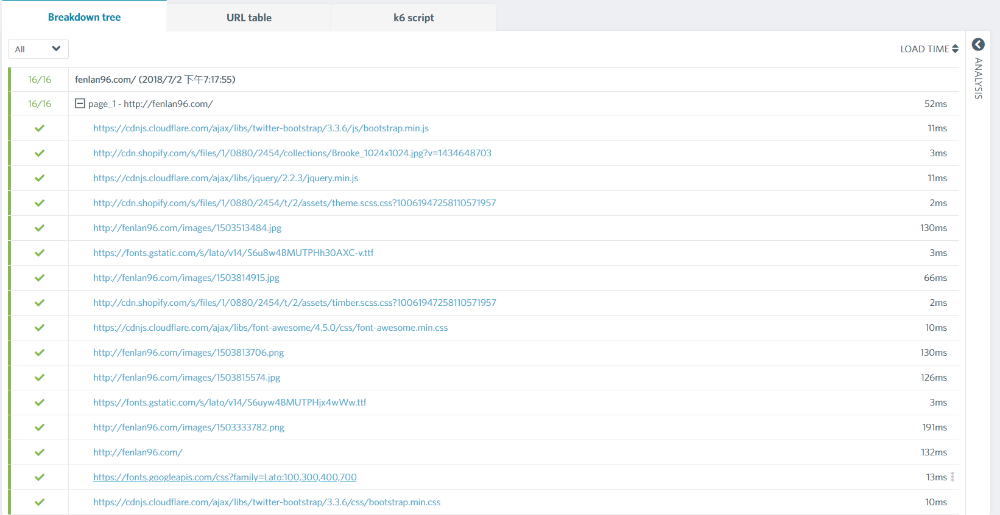
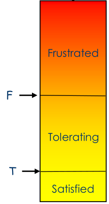
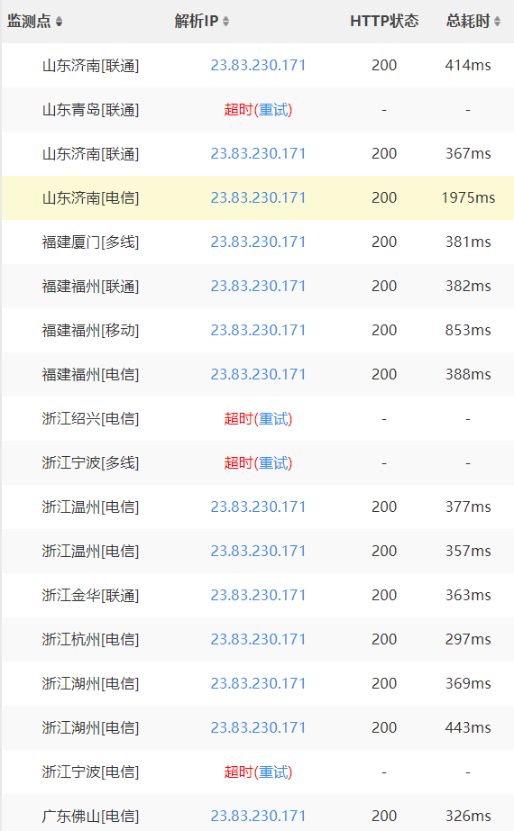
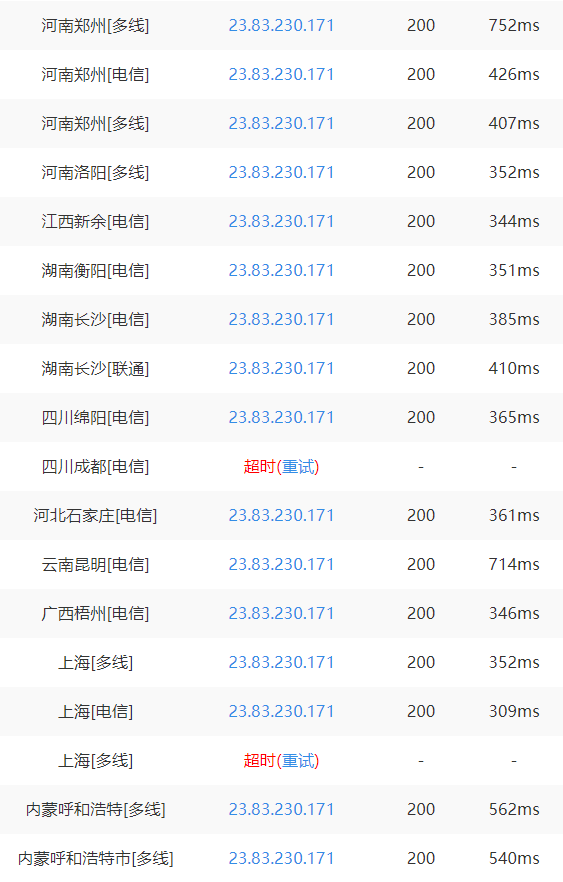

网上书店性能与可用性分析
========================

**一、应用性能**
================

**1. 响应时间。**
=================

使用站长工具（http://tool.chinaz.com/speedtest）对网站进行速度测试，结果如下：

可以看到，绝大部分地区的连接顺利，一些地区延迟较高，这主要与网站服务器质量及地理位置有关。

可以考虑选用具有更高带宽的服务器，更进一步地，可以在全国各地设置多服务器。

**2. 并发用户。**
=================

使用在线测试网站服务器负载性能的工具Load
Impact，该网站可以自动创建测试脚本，模拟50个用户同时访问网站。结果如下：

可以看出网站可以在50人同时访问页面时延迟处于可以接受的范围。

若要显著提高网站的可负载用户数量，除了同样需要升级服务器的配置外，还可考虑以下策略：

-   优化代码；

-   数据库：采用分库分表；

-   使用内存型数据存储：使用Redis等内存缓存可以提高读写速度，在数据落库之前快速读写数据，使用MongoDB等作为大字段，多字节的key-value保存方式，防止关系型数据库的不足；

-   负载均衡：使用Nginx等负载均衡中间件，将请求分布到不同的机器上。

**3. 用户体验。**
=================

1. 使用Apdex指数度量本网站的用户体验。

首先，基于本网站的特性，我们定义期望响应时间T=400ms，接下来，根据

来进行用户满意度的预测。

然后，对之前进行速度测试的各地连接情况进行统计：

可以得到，总耗时在400ms以内的监测点有19个，在400ms~1600ms内的有10个，超过1600ms（包括连接超时）的有7个，总共36个监测点。

计算ApdexT = (19 + 10 / 2) / 36 = 0.67,
勉强可以认为达到Fair的一般标准。

2. 用户使用感受。

我们邀请了几位同学进行网站的实际体验，这里记录了他们的使用感受：

-   UI分格简洁美观；

-   有搜索功能，更加方便；

-   操作方式友好，只需简单的点击即可使用大多数功能；

-   包含分享功能，能更方便地向好友推荐心仪的书籍；

-   书目详情页面提供的书籍信息太少；

-   在没有登录的情况下无法进行购买等特定操作，并且缺少必要的提示；

-   搜索功能不够完善；

当然，由于测试次数限制以及无法进行大规模的用户调研，实际的用户体验情况可能有所出入，总体来看，本网站的用户体验差强人意，但仍有很多需要改进之处。

首要的是对访问速度的改进，不过限于我们使用的是位于海外的服务器，要做到这一点需要考虑资金的问题；

其次，用户的交互上还需完善，尤其是在容易造成用户困惑的地方给出必要的提示；

最后，对书籍信息进行更详尽的分类，一来给用户提供更多详细信息，二来摘取更多关键字来完善搜索功能。

**二、应用可用性**
==================

1.
易学性和易记性：本应用（网站）的所有操作均与一般的网上书店应用类似，没有特别需要学习或记忆的地方；

2.
有效性：除了之前提到的搜索功能有所欠缺之外，其他操作均能有效地完成工作，这一点将在之后进行改进；

3.
效率：所有功能（包括注册、登录、浏览书籍、加入购物车以及结账等）都能在不超过3次操作（点击、输入等）中完成，可以说效率很高；

4.
容错率：归功于简洁的UI和明晰的交互体验，用户使用本网站时的误操作频率并不高。另外，在常见的用户误操作情况下，本网站均提供了友好的错误信息提示（如登录时用户名或密码的输入错误），必要时还提供了撤销操作的功能（如将误添加进购物车的书籍移除）。

5. 用户满意度：详见上文。
