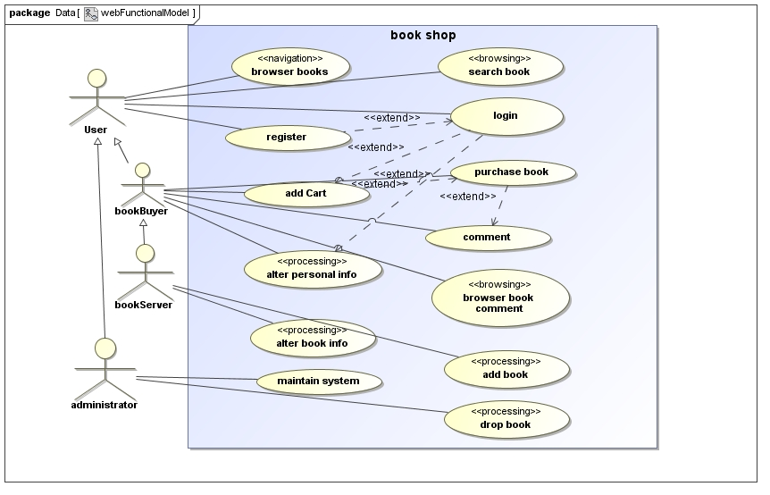
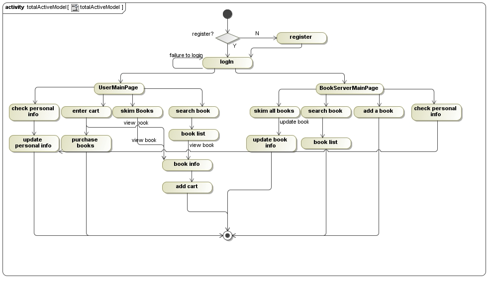
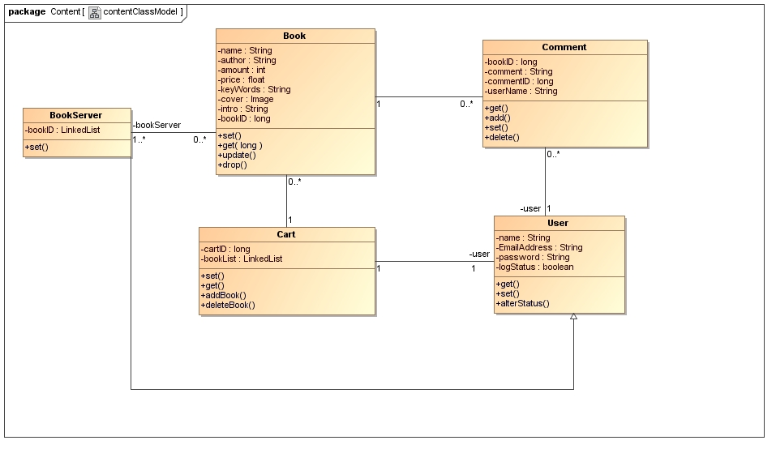
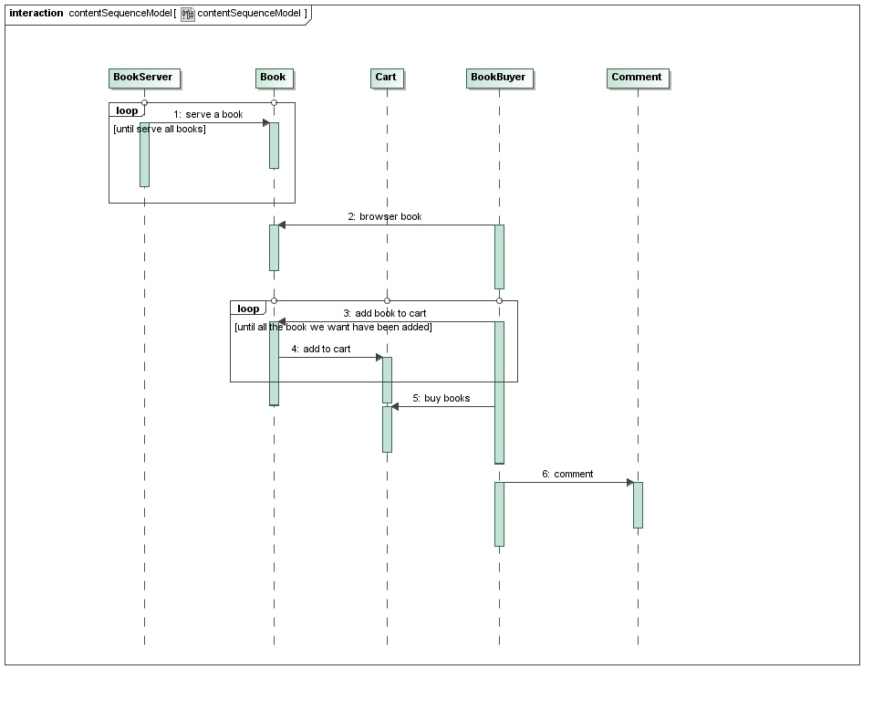
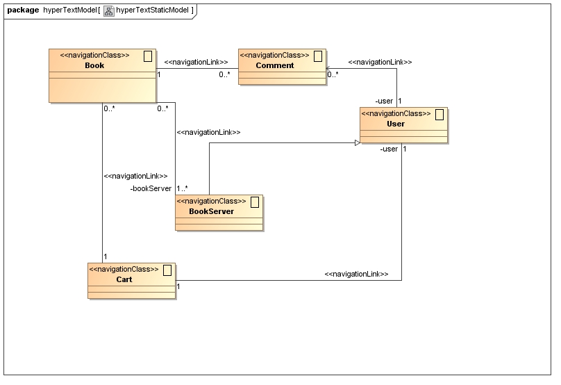
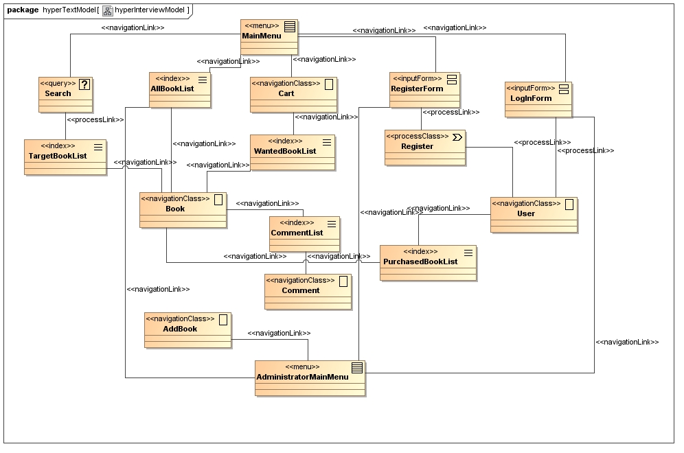
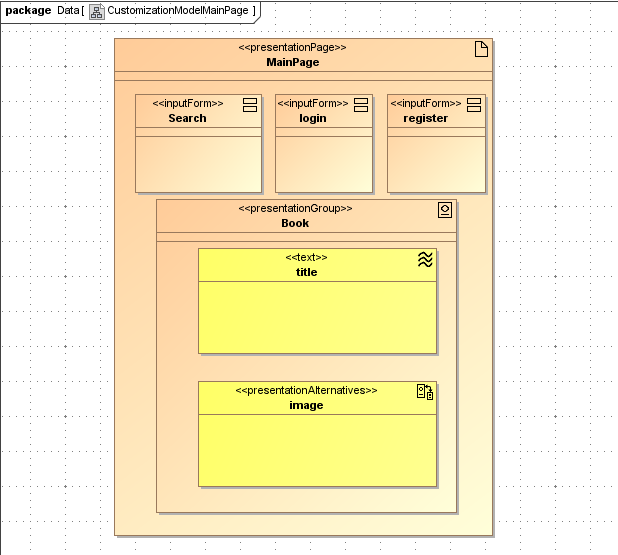
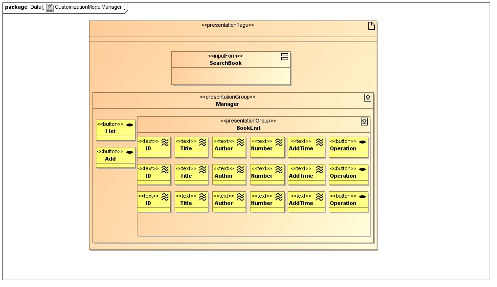

# web应用建模

提要：以下我们将分别从功能需求、内容、超文本、适应性四个方面进行建模。

## 功能需求

### 静态模型

  
本系统中的参与者有四类：普通游客，图书购买者，图书提供者和系统管理员。  
为所有用户提供的功能有：浏览图书信息和评论，检索图书，注册和登录。  
为图书购买者特殊提供的功能有：将图书加入购物车、购买图书、更改个人信息。  
为图书提供者特殊提供的功能有：更改图书信息和添加图书。  
为系统管理员提供的功能有：维护系统。  

### 动态模型

  

一开始进入本网站，用户可以选择注册或登录，当用户登录了之后，可以使用用户个性化操作。图书购买者首先会进入用户主页，在当前页面，用户可以选择检查个人信息，进入购物车，浏览图书和检索图书的操作。当用户选择查看个人信息时，会跳转到用户个人信息界面，在当前界面用户可以更改个人信息。当用户进入购物车时，用户可以选择购买图书和调整图书数量的操作，同时也提供查看图书具体信息的操作。当用户选择浏览图书时，用户可以浏览所有图书缩略信息，这时可以选择选择图书查看图书详细信息。当用户选择检索图书时，用户输入图书关键字可以进行检索。在用户查看图书详细信息的时候，用户可以选择将图书添加到个人购物车。  
图书提供者会进入图书信息操作界面。此时用户可以选择浏览所有图书、检索图书、添加图书和查看个人信息的操作。当用户选择浏览图书时，用户可以看到图书的简略信息，此时用户可以选择一本图书进行更新或者查看详细信息操作。当用户检索图书时，可以根据关键字查找图书。用户选择添加图书操作时，可以添加一本图书的详细信息。当用户选择查看个人信息时，可以选择更改个人信息操作。  

注：模型中只包括登录用户的行为。  

## 内容

### 静态模型

  
系统主要有五个组成部分，分别为：图书，图书提供者、用户、购物车和评论。其中每个用户固定绑定一个唯一个人购物车，每个购物车可以存放零本至无数本图书，每本图书对应零条至无数条评论，用户购买图书之后，可以对图书进行评论操作，图书提供者可以提供图书和修改图书信息。  

### 动态模型

  
首先需要有图书提供者来为系统提供图书，之后用户可以浏览图书信息和将图书加入到个人购物车，然后购买图书，最后对购买的图书进行评论。  

## 超文本

### 静态模型
  
如图：用户与购物车和评论绑定，评论与图书绑定，图书与图书提供者绑定，购物车包含图书信息。  

### 动态模型
  
如图，系统的各部分的导航结构。从主页开始，我们可以进入搜索、所有图书列表、购物车、注册表、登录表部分，搜索进行之后，展示目标图书简缩信息列表，从购物车可以看到我们添加的图书简缩信息列表，从目标图书列表，所有图书列表，已添加图书列表可以转到图书详细信息界面。从注册表注册之后或登录之后进入用户界面，然后可以进入购买图书列表，可以导航至图书详细信息界面。图书绑定评论，从评论列表可以看到简略评论信息，可以导航至详细评论信息界面。管理员界面可以导航至注册、添加图书和所有图书信息界面。  

## 适应性

### 图书购买者主页
  
[展示](http://fenlan96.com/)  

### 图书提供者主页
  
  