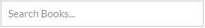
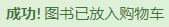
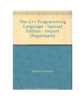
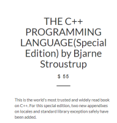
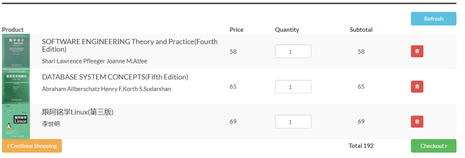

# 交互设计
## 直接了当的交互

顶部导航栏  

搜索框

页面导航

邮件信息

购物
***
# 展示设计
## 多层架构
分为上中下，分别为导航栏，图书信息，版权信息
## 合理布局
导航，搜索位置显而易见，符合用户习惯；文字，图片，色彩构成风格统一，协调的主题。
使用table，frame，div等配合css，使模块，图书信息等排列整齐
## 特征鲜明
书的图片，标题等突出书店特征。标识位置显著
## 线框分割
线框与按钮颜色的配合，增强界面友好性，易操作性
## 页面引导
提供返回首页，返回继续购物等引导
## 美学设计
简约的风格，暗淡之间分隔元素，亮丽和谐的按钮
***
# 内容设计
## 首页
用户导航栏——便于用户的登陆、注册。（每个页面均提供该组件）
搜索栏——便于用户搜索想要的图书
联系信息——便于作者或出版社与网站进行商业联系
书籍推荐——为用户推荐网站精选的图书
## 书籍页
	书籍缩略图		         书籍详情	               分享链接
                  
## 购物车页

提供了所购图书的书名、单价、数量、总价。
用户可选择继续浏览、结算或者刷新购物车。
***
# 功能设计
## 公共模块
`1.`账号的注册、登录、注销
`2.`转账交易
`3.`会话
## 图书提供者模块：
`1.`商户或出版社的认证
`2.`图书信息的增删改查
`3.`浏览用户购买图书信息
`4.`浏览用户意见信息 
## 图书购买者模块：
`1.`浏览与查找图书信息
`2.`提交购买图书订单
`3.`修改个人信息
`4.`添加图书评论

 

