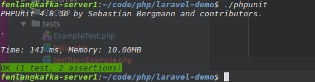
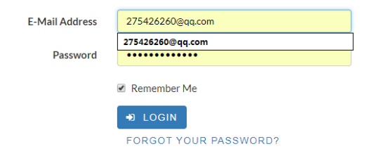
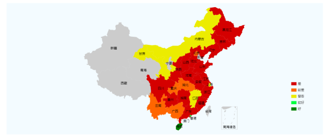

# 网上书店测试文档

## 单元测试
测试工具：phpunit
单元测试（模块测试）是开发者编写的一小段代码，用于#检验被测代码的一个很小的、很明确的功能是否正确。通常而言，一个单元测试是用于判断某个特定条件（或者场景）下某个特定函数的行为。此处，我们以测试一个显示主页面的函数index()函数。
测试代码如下：

测试结果如下：

图中可以看出，该部分代码成功通过测试！
******
## 功能测试
1.链接测试
测试工具：使用的工具为“Xenu链接检测侦探”，这是一款被广泛使用的死链检测工具。可以检测到网页中的普通链接，图片，框架，插件，背景，样式表，脚本和Java程序中的链接。
测试方法：打开Xenu—File—Check URL...，输入待测试的网站（本项目中网站为fenlan96.com），点击OK，即可开始测试。
测试结果：
Skip external —— 跳过外部链接测试
OK —— 测试通过
Not found —— 死链接

生成的报告为：

可以看到网站存在一个死链，在测试结束后会进行修复。
2.表单测试
（1）输入系统支持的数据格式测试用例分析

（2）输入非系统支持的数据格式测试用例分析

一、搜索框测试
1.非空校验
a.未输入——按回车仍停留在当前页面；
b.只输入若干个空格，未输入其它字符——提示NOT 
FOUND。
二、登录页面用户名测试
1.非空校验
a.未输入——提示The email field 	is required。
b.只输入若干空格，未输入其他字符——提示 The 
email field is required。
2.格式检验
a.输入非邮箱格式的字符串——报错

b.输入错误的邮箱格式——未提示

二、登录页面密码测试
	1.非空校验
a.未输入——

b.只输入若干个空格，未输入其它字符——

2.与用户名是否匹配校验
a.输入错误的密码——

三、登录页面Remember Me按单选框测试
	选中Remember Me后，登录成功时成功保存用户名和密码。

未选中Remember Me时，登录成功不保存用户名和对应的密码。
四、购物车页面数量文本框
1.非空校验
a.不输入——商品总价变为NaN

b.输入空格——该文本框不能输入空格
2.特殊值
a.输入负数——商品总值变为负数

b.输入字母——该文本框无法输入字母
c.使用粘贴方式输入字母——粘贴输入也被禁止
3.Cookies测试
由表单测试可以看出用户名处Cookies能正常工作，下图则体现了搜索框的Cookies也能正常工作，且保存时间为第一次对某字符串进行搜索后，刷新不会对Cookies有影响。

4.设计语言测试
因Web设计语言版本的差异可以引起客户端或服务器端严重的问题，例如使用哪种版本的HTML等。当在分布式环境中开发时，开发人员都不在一起，这个问题就显得尤为重要。除了HTML的版本问题外，不同的脚本语言，例如Java、javascript、 ActiveX、VBScript或Perl等也要进行验证。
因为本网站已在较为成熟的框架上构建而成，故此处设计语言测试理论上不存在较大问题。
5.数据库测试
在Web应用技术中，数据库起着重要的作用，数据库为Web应用系统的管理、运行、查询和实现用户对数据存储的请求等提供空间。在Web应用中，最常用的数据库类型是关系型数据库，可以使用SQL对信息进行处理。在使用了数据库的Web应用系统中，一般情况下，可能发生两种错误，分别是数据一致性错误和输出错误。数据一致性错误主要是由于用户提交的表单信息不正确而造成的，而输出错误主要是由于网络速度或程序设计问题等引起的，针对这两种情况，可分别进行测试。
经测试，我们的数据库在用户网络正常的情况下能够正确的保存用户提交的表单信息。数据库测试基本通过。在用户网络异常或网络速度过慢的情况下，数据库无法接收到用户提交的表单信息。
下图即为用户注册所提交的表单信息。

******
## 性能测试
1.连接速度测试
该测试使用的是在线网站17ce.com提供的测速服务，结果如下：

由测试结果可以看出，虽然连接速度偏慢，但是基本可以满足大部分用户的需求。
2.负载测试
该测试使用的是在线测试网站服务器负载性能的工
Load Impact，该网站可以自动创建测试脚本，模拟50个用户同时访问网站。结果如下：

可以看出网站可以在50人同时访问页面时延迟处于可以接受的范围，遗憾的是此次测试未能测试出网站的最大负载。
******
## 安全性测试
1.网站采用先注册、后登陆的方式。用户名和密码错误时不可登录网站，密码对大小写敏感。没有对用户的登录次数作为限制。在用户未登录时，除了购物车页面和其下属页面，其余页面均可访问。
2.网站未设置超时限制，用户未点击注销，则登录状态一直保持到页面关闭。
3.XSS注入测试
在网站的搜索框中输入以下代码：
 "/><!-
网站并未弹出对话框，故XSS测试通过。
4.SQL注入测试
在正常用户名后增加一个单引号，点击登录

提示报错

故网站没有对’进行过滤，存在SQL注入漏洞，将在以后的过程中修复。
******
## UI测试
UI测试确保用户界面会通过测试对象的功能来为用户提供相应的访问或浏览功能；2、确保用户界面符合公司或行业的标准。通过用户界面 (UI) 测试来核实用户与软件的交互。
一、导航测试：
导航描述了用户在一个页面内操作的方式，在不同的用户接口控制之间，例如按钮、对话框、列表和窗口等；或在不同的连接页面之间。  导航的另一个重要方面是Web应用系统的页面结构、导航、菜单、连接的风格是否一致。

在导航测试中，未发现任何问题。各个测试用例均能正确的返回预想的输出结果。
二、表单测试

测试用例：

各项测试用例均通过，未发现问题。
三、兼容性测试
在Chrome浏览器、FireFox浏览器、360浏览器中，网站
各网页可以正常显示：

在IE浏览器中，用户导航栏部分“Login”和“Register”丢失，推荐书籍图片页丢失。

IE中出现的以上问题将在后续过程中修复。
